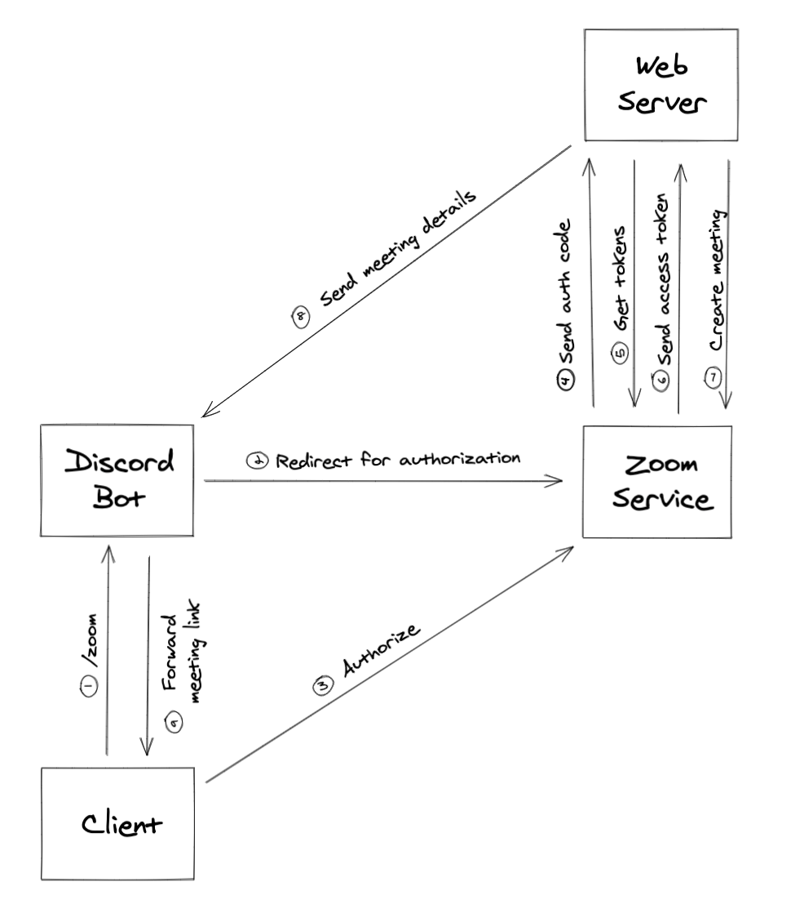

<p align="center">
  
</p>

## Idea

Streamline your entire workflow through Discord. Easily start a meeting and share the link with every using the "/zoom" slash command. Schedule meetings and view your upcoming meetings directly in the Discord channel. Additionally get a meeting summary and know exactly when someone joined or left the meeting.

- Start or join Zoom Meetings with one command.
- See real-time how long the Zoom Meeting has been running and its current status right in Discord.
- Keep an eye on who joins or leaves your Zoom Meeting.
- See the meeting and participant summary for your Zoom Meeting after it ends.

<Screenshot placeholder here!!>

## Getting started

### Prerequisites

- Julia
- Git

### Clone

- Clone this repo to your local machine.
```shell
$> git clone https://github.com/MLH-Fellowship/ZoomCord.git
```

### Setup Genie server

- Setup Julia environment. This will install all required dependencies and exit.
```julia
$> julia
julia> ]activate .
julia> exit()
```

- Generate a secrets file for signing and encrypting sensitive Genie data.
```julia
julia> Genie.REPL.write_secrets_file()
```

- Start Genie server
```shell
$> bin/server
```

- Visit `HOST:PORT/start/` URL on your browser to start Discord bot. 


Access the app on `http://localhost:8000`

## OAuth Workflow
The first time you use the Zoom slash command in Discord, you will be asked to login to Zoom (if you are not already logged in) and approve the app's access to Zoom. 

Zoom uses OAuth to allow an application to access user-authenticated data for use with third party applications which ZoomCord uses to create meetings and provide other features.
The process is somewhat complex and is detailed in the image below:




## Technology Stack

- [Zoom API](https://marketplace.zoom.us/docs/api-reference/zoom-api) : API used to communicate with Zoom.
- [Discord.jl](https://github.com/Xh4H/Discord.jl) : Package to interact with Discord's API.
- [Julia](https://julialang.org/) : High level programming language for numerical analysis and computational sciences.
- [Genie.jl](https://github.com/GenieFramework/Genie.jl): The highly productive Julia web framework.

## Contributors:

- [Diaga](https://github.com/Diaga)
- [makrandr1999](https://github.com/makrandr1999)
- [abhishalya](https://github.com/abhishalya)

## License
The project is MIT licensed.
